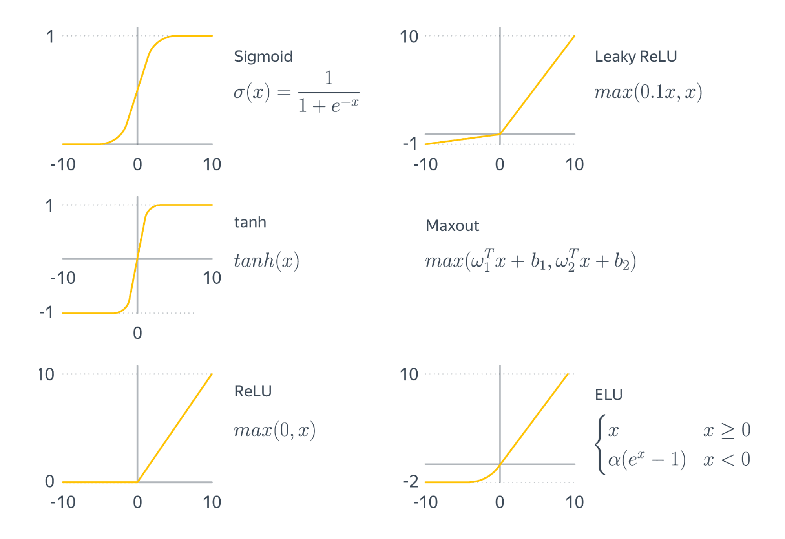

# Лекция 1

### Ссылки на полезные и использованные материалы

- Хэндбук Яндекса по ML (<https://education.yandex.ru/handbook/ml>);
- Кэвин К.П. - Вероятностное машинное обучение: Введение;
- Loss Landscape (<https://losslandscape.com>)
- Машинное обучение (курс лекций, К.В.Воронцов) (<https://bit.ly/ML-Vorontsov>)

## 1. Нейронные сети и с чем их едят

**Вопросы:** Что такое нейронные сети? Задачи глубокого обучения.

_Нейронная сеть_ по сути своей представляет из себя "универсальный" аппроксиматор. Это означает, что она может приблизить какую-либо зависимость с любой точностью при увеличении размеров. Такое свойство позволяет решать огромное множество задач. Такие задачи, решаемые с помощью нейронных сетей относят к разделу машинного обучения — _глубокому обучению_.

Можно выделить несколько наиболее частых задач, которые решает глубокое обучение:

1. **Работа с численными данными**:
   - **Регрессия**: предсказание непрерывной переменной на основе других переменных.
   - **Классификация**: разделение объектов на заданные классы на основе набора признаков.
   - **Автоэнкодеры**: использование нейронных сетей для извлечения сжатого/разреженного представления численных данных.
   - **Детекция аномалий**: определение и классификация аномальных или необычных объектов.
2. __Работа с визуальными данными__:
   - **Обаружение объектов**: выделение и классификация объектов на изображении.
   - **Сегментация изображений**: разделение изображения на семантические сегменты, относящиеся к разным объектам.
   - **Классификация изображений**: определение класса или категории изображения.
   - **Генерация изображений**: создание новых изображений на основе существующего набора данных.
   - **Повышение разрешения изображений**: увеличение детализации изображения.
3. __Работа с аудио-данными__:
   - **Распознавание и синтез речи**: преобразование звуковой волны в текст и наоборот.
   - **Транскрипция аудио**: перевод аудио в текстовую форму.
   - **Эмоциональный анализ**: определение эмоционального состояния человека по аудиофайлу.
   - **Генерация музыки**: создание новых музыкальных треков на основе существующих данных.
4. __Работа со средой (обучение с подкреплением)__:
   - **Игры**: использование глубокого обучения для обучения агента играть в компьютерные игры.
   - **Автопилоты**: обучение автомобилей или дронов пилотированию на основе наблюдений из окружающей среды.
   - **Рекомендательные системы**: предложение наиболее релевантных рекомендаций на основе действий пользователя.
   - **Управление роботами**: обучение роботов выполнять задачи на основе восприятия среды и награды.
   - **Оптимизация процессов**: использование обратной связи для оптимизации сложных систем, таких как производственные или логистические процессы.

Это не полный список возможных задач, решаемых нейросетями. Можно решать различные сложные задачи, если правильно построить архитектуру системы, заручиться данными и грамотно поставить задачу оптимизации.

## 2. Модель нейрона. Многослойный персептрон

**Вопросы:** Модель нейрона. МСП. Функции активации. НС, как сложная параметризованная функция.

### Модель нейрона

Искусственный нейрон состоит из трех основных компонентов: входные данные, взвешенный сумматор и функция активации.

1. Входные данные: нейрон принимает вектор входных данных $x\in\mathbb{R}^n$.
2. Сумматор: каждая входная переменная имеет связанный с ней вес, обозначаемый как $w_i$. Вектор весов обозначается как $w=[w1,w2,…,wₙ]^T$. Тогда сумматорная функция выглядит как $u\ =\ \sum_{i=1}^{n}{w_ix_i}=\langle w,x\rangle$
3. Функция активации: нейрон принимает взвешенную сумму входных данных и применяет функцию активации к этой сумме. Функция активации определяет выходной сигнал нейрона $y=\varphi\left(u\right)$.

Тогда модель нейрона представима формулой: $$y=\varphi\left(\sum_{i=1}^{n}{w_ix_i}\right) = \varphi\left( w^T x\right)$$

### Искуственная нейронная сеть

**Искусственная нейронная сеть** (далее — нейронная сеть) — это сложная дифференцируемая функция, задающая отображение из исходного признакового пространства в пространство ответов, все параметры которой могут настраиваться одновременно и взаимосвязанно. В частном (и наиболее частом) случае представляет собой последовательность (дифференцируемых) параметрических преобразований.

Можно заметить, что под указанное выше определение нейронной сети подходят и логистическая, и линейная регрессия. Действительно, и линейная, и логистическая регрессии могут рассматриваться как нейронные сети, задающие отображения в пространство ответов и логитов соответственно.

Сложную функцию удобно представлять в виде суперпозиции простых, и нейронные сети обычно предстают перед программистом в виде конструктора, состоящего из более-менее простых блоков (слоёв, layers). Вот две простейшие их разновидности:

- Линейный слой (linear layer, dense layer) — линейное преобразование над входящими данными (его обучаемые параметры — это матрица $W$ и вектор $b$): $x\longmapsto xW+b (W\in\mathbb{R}^{d\times k},x\in\mathbb{R}^d,b\in\mathbb{R}^k)$. Такой слой преобразует $d$-мерные векторы в $k$-мерные.
- Функция активации (activation function) — нелинейное преобразование, поэлементно применяющееся к пришедшим на вход данным. Благодаря функциям активации нейронные сети способны порождать более информативные признаковые описания, преобразуя данные нелинейным образом. Может использоваться, например, ReLU (rectified linear unit) $ReLU\left(x\right)=max\left(0,x\right)$ или сигмоида (логистическая функция) и другие.

Нейросеть, в которой есть только линейные слои и различные функции активации, называют **полносвязной** (fully connected) нейронной сетью или **многослойным перцептроном** (multilayer perceptron, MLP).

Примеры простейших архитектур НС:

### Немного о мощи нейронных сетей

## 3. Обучение нейронной сети

Так как мы договорились, что нейросети представляют собой параметризованные дифференцируемые функции и для каждого параметра мы можем посчитать градиент, то, так же как и линейные модели, их можно настраивать с помощью градиентных методов.

### 3.1. Функции потерь

Для нахождения параметров модели, к примеру весов полносвязной нейронной сети, решают задачу оптимизации функционала, отвечающего за качество модели. В задачах обучения с учителем пользуются методом __минимизации эмпирического риска__. Эмпирический риск --- это средняя величина ошибки алгоритма на обучающей выборке.

Вводится функция потерь $\mathcal{L}\left( y,y^{'} \right)$, характеризующая величину отклонения ответа $y = a(x)$ от правильного ответа $y^{'} = y^{*}(x)$ на произвольном объекте $x \in X$. Вводится модель алгоритмов $A = \ \text{\{}a:\ \ X \rightarrow Y\text{\}}$, в рамках которой будет вестись поиск отображения, приближающего неизвестную целевую зависимость. Тогда эмпирический риск есть функционал качества, характеризующий среднюю ошибку алгоритма a на выборке $X^{m}$:

$$Q\left( a,X^{m} \right) = \frac{1}{m}\sum_{i = 1}^{m}{\mathcal{L}\left( a\left( x_{i} \right),y^{*}\left( x_{i} \right) \right)}.$$

Метод минимизация эмпирического риска заключается в том, чтобы в заданной модели алгоритмов A найти алгоритм, доставляющий минимальное значение функционалу эмпирического риска:

$a = \text{arg}\min_{a \in A}Q\left( a,X^{m} \right)$.

Пусть у нас есть выборка данных $x_{1},x_{2},\ldots,x_{n}$, которые являются независимыми и одинаково распределенными случайными величинами с плотностью распределения $f\left( x \middle| \theta \right)$, где
$\theta$ - вектор параметров модели. Тогда можно выбирать функцию потерь и оценивать параметры методом максимума правдоподобия. Функция правдоподобия L(θ) определяется как произведение плотностей распределения для всех наблюдений:

$$L(\theta) = f\left( x_{1} \middle| \theta \right) \bullet f\left( x_{2} \middle| \theta \right) \bullet \ldots \bullet f\left( x_{n} \middle| \theta \right) \rightarrow \ max$$

Метод максимального правдоподобия заключается в нахождении такого вектора параметров θ, при котором функция правдоподобия принимает наибольшее значение. Формально, это сводится к решению задачи оптимизации:

$$\theta_{MLE} = argmaxL(\theta)$$

Часто вместо прямого максимизирования функции правдоподобия, минимизируют отрицательный логарифм правдоподобия $- log\left( L(\theta) \right)$, так как она имеет аналогичные экстремальные точки, но произведение переходит в сумму и становится легче искать производную. Таким образом, задача сводится к решению следующей оптимизационной задачи:

$$\theta_{MLE} = \arg\min_{\theta}\left\lbrack –log\left( L(\theta) \right) \right\rbrack = \arg\min_{\theta}\left\lbrack –\sum_{i = 1}^{n}{\log\left( f\left( x_{1} \middle| \theta \right) \right)} \right\rbrack$$

Из ММП прямо вытекают некоторые популярные функции потерь, такие как перекрёстная энтропия (кроссэнтропия) и средний квадратов ошибок (или сумма квадратов ошибок):

1. Перекрёстная энтропия (Cross-entropy) является мерой сходства между двумя вероятностными распределениями. Обозначим истинное распределение данных как p(x), а предсказанное моделью распределение как q(x). Тогда кросс-энтропия определяется следующим образом:

   $$H(p,q) = - \sum_{}^{}\left( p(x) \bullet log\left( q(x) \right) \right)$$

   Можно показать, что если принять распределение данных за дискретное с $k$ возможных исходов, тогда ММП сводится к кросс-энтропии:

   $$L(X,\theta) = p\left( y \middle| X,\theta \right) = \prod_{i = 1}^{n}{p\left( y_{i} \middle| x_{i},\theta \right)} = \prod_{i = 1}^{n}{\prod_{j = 1}^{k}a_{i,j}^{y_{i,j}}},$$

   $$–log\left( L(X,\theta) \right) = \ –\sum_{i = 1}^{n}{\sum_{j = 1}^{k}y_{ij}}\log{\ a}_{ij} = - \sum_{}^{}\left( p(x) \bullet log\left( q(x,\theta) \right) \right),$$

   где $y_{ij} \in \text{\{}0,1\text{\}}$.

2. Квадрат ошибки является функцией потерь, широко используемой в задачах регрессии. Тогда полагают модель отклика вида:

   $$y = a(x,\theta) + \varepsilon,$$

   где $\varepsilon\sim N\left( 0,\ \sigma^{2} \right)$. Тогда $y\sim N\left( a(x,\theta),\ \sigma^{2} \right)$ и мы оцениваем матожидание нормального распределения.

   $$L(X,\theta) = \prod_{i = 1}^{n}{p\left( y_{i} \middle| x_{i},\theta \right)} = \prod_{i = 1}^{n}\frac{1}{\sqrt{2\pi\sigma^{2}}}\exp\frac{\left( y_{i} - a\left( x_{i},\theta \right) \right)^{2}}{2\sigma^{2}} \rightarrow \min_{\theta},$$

   $$–log\left( L(X,\theta) \right) = \ \frac{n}{\sqrt{2\pi\sigma^{2}}}\sum_{i = 1}^{n}\left( y_{i} - a\left( x_{i},\theta \right) \right)^{2}–2n\sigma^{2} \rightarrow \min_{\theta},$$

   $$\Leftrightarrow \sum_{i = 1}^{n}\left( y_{i} - a\left( x_{i},\theta \right) \right)^{2} \rightarrow \min_{\theta}$$

   Часто в качестве эмпирического риска берут средний квадрат ошибок:

   $$MSE = \frac{1}{n}\sum_{i = 1}^{n}\left( y_{i} - a\left( x_{i},\theta \right) \right)^{2}$$

Часто в случаях, когда надо приблизить сложное распределение $p(x)$ более простым распределением $q(x)$ минимизируют дивергенцию Кульбака-Лейблера. KL-дивергенция (Kullback-Leibler divergence) является мерой расхождения между двумя вероятностными распределениями:

$$D_{KL}(p \parallel q) = \int_{X}^{}{p(x)\log\frac{p(x)}{q(x)}}d\mu\  \rightarrow \ min,$$

KL-дивергенция неотрицательна и несимметрична относительно перестановки элементов. Также можно заметить, что для дискретных распределений KL-дивергенция есть разность перекрёстной энтропии распределений $p(x)$ и $q(x)$ и энтропии $p(x)$:

$$D_{KL}(p \parallel q) = H(p,q) - H(p).$$

### 3.2. Обратное распространение ошибки

Нейронные сети обучаются с помощью тех или иных модификаций градиентного спуска, а чтобы применять его, нужно уметь эффективно вычислять градиенты функции потерь по всем обучающим параметрам. Казалось бы, для какого-нибудь запутанного вычислительного графа это может быть очень сложной задачей, но на помощь спешит метод обратного распространения ошибки.

Суть метода можно записать одной формулой, тривиально следующей из формулы производной сложной функции: если $f(x) = g_m(g_{m-1}(\ldots (g_1(x)) \ldots))$, то $\frac{\partial f}{\partial x} = \frac{\partial g_m}{\partial g_{m-1}}\frac{\partial g_{m-1}}{\partial g_{m-2}}\ldots \frac{\partial g_2}{\partial g_1}\frac{\partial g_1}{\partial x}$. Уже сейчас мы видим, что градиенты можно вычислять последовательно, в ходе одного обратного прохода, начиная с $\frac{\partial g_m}{\partial g_{m-1}}$ и умножая каждый раз на частные производные предыдущего слоя.

#### Backpropagation в одномерном случае

В одномерном случае всё выглядит особенно просто. Пусть $w_0$ — переменная, по которой мы хотим продифференцировать, причём сложная функция имеет вид $$f(w_0) = g_m(g_{m-1}(\ldots g_1(w_0)\ldots)),$$ где все $g_i$ скалярные. Тогда $$f'(w_0) = g_m'(g_{m-1}(\ldots g_1(w_0)\ldots))\cdot g'_{m-1}(g_{m-2}(\ldots g_1(w_0)\ldots))\cdot\ldots \cdot g'_1(w_0)$$ Суть этой формулы такова. Если мы уже совершили forward pass, то есть уже знаем $$g_1(w_0), g_2(g_1(w_0)),\ldots,g_{m-1}(\ldots g_1(w_0)\ldots),$$ то мы действуем следующим образом:

- берём производную $g_m$ в точке $g_{m-1}(\ldots g_1(w_0)\ldots)$;
- умножаем на производную $g_{m-1}$ в точке $g_{m-2}(\ldots g_1(w_0)\ldots)$;
- и так далее, пока не дойдём до производной $g_1$ в точке $w_0$.

Проиллюстрируем это на картинке, расписав по шагам дифференцирование по весам
функции потерь логистической регрессии на одном объекте (то есть для батча размера 1):

Собирая все множители вместе, получаем:
$$\frac{\partial f}{\partial w_0} = (-y)\cdot e^{-y(w_0 + w_1x_1 + w_2x_2)}\cdot\frac{-1}{1 + e^{-y(w_0 + w_1x_1 + w_2x_2)}}$$ $$\frac{\partial f}{\partial w_1} = x_1\cdot(-y)\cdot e^{-y(w_0 + w_1x_1 + w_2x_2)}\cdot\frac{-1}{1 + e^{-y(w_0 + w_1x_1 + w_2x_2)}}$$ $$\frac{\partial f}{\partial w_2} = x_2\cdot(-y)\cdot e^{-y(w_0 + w_1x_1 + w_2x_2)}\cdot\frac{-1}{1 + e^{-y(w_0 + w_1x_1 + w_2x_2)}}$$

Таким образом, мы видим, что сперва совершается forward pass для вычисления всех промежуточных значений (и да, все промежуточные представления нужно будет хранить в памяти), а потом запускается backward pass, на котором в один проход вычисляются все градиенты.

#### Backpropagation в общем виде

Подытожим предыдущее обсуждение, описав алгоритм error backpropagation (алгоритм обратного распространения ошибки). Допустим, у нас есть текущие значения весов $W^i_0$ и мы хотим совершить шаг SGD по мини-батчу $X$. Мы должны сделать следующее:

1. Совершить forward pass, вычислив и запомнив все промежуточные представления $X = X^0, X^1, \ldots, X^m = \widehat{y}$.
2. Вычислить все градиенты с помощью backward pass.
3. С помощью полученных градиентов совершить шаг SGD.

Проиллюстрируем алгоритм на примере двуслойной нейронной сети со скалярным output'ом. Для простоты опустим свободные члены в линейных слоях.

### 3.3. Метод стохастического градиента

Пусть задача обучения модели представлена минимизацией эмпирического риска:

$$Q(w) = \frac{1}{n}\sum_{i = 1}^{n}{\mathcal{L}_{i}(w)} \rightarrow \min_{w}.$$

Тогда можно применить метод градиентного спуска:

$$w^{(t + 1)} ≔ w^{(t)}–h \bullet \nabla Q\left( w^{(t)} \right)$$

$$\nabla Q(w) = \nabla\left( \frac{1}{n}\sum_{i = 1}^{n}{\mathcal{L}_{i}(w)} \right) = \frac{1}{n}\sum_{i = 1}^{n}{{\nabla\mathcal{L}}_{i}(w)}$$

Проблема возникает, когда размер выборки $n$ достаточно велик. Для решения этой проблемы используют стохастическую оценку градиента
эмпирического риска. Вместо того, чтобы считать сумму по всей выборке, используют один из двух подходов, основанных на случайности:

1. На каждой итерации случайно берут одно наблюдение из выборки и по нему считают ошибку предсказания. После этого эмперический риск оценивается рекуррентно с учётом предыдущих итераций методом экспоненциального скользящего среднего ($\lambda \in [0,1]$).
   $${\widehat{Q}}_{j}(w) = \lambda\sum_{i = 1}^{k}{\mathcal{L}_{i}(w)} + (1 - \lambda){\widehat{Q}}_{j - 1}(w)$$
2. На каждой итерации случайно берут небольшую подвыборку размера $k \ll n$, называемую батчем (batch). По ней для данной итерации считается  Таким образом мы получаем несмещённую оценку эмпирического риска.
   $$\widehat{Q}_{j}(w) = \frac{1}{k}\sum_{i = 1}^{k}{{\mathcal{L}}_{i}(w)}$$

Для выпуклых функций сходимость гарантируется при:

$$h_{t}\overset{t \rightarrow \infty}{\rightarrow}0,\ \ \sum_{t = 1}^{\infty}h_{t} = \infty,\ \ \sum_{t = 1}^{\infty}h_{t}^{2} < \infty.$$

### 3.4. Регуляризация

Регуляризация - это методы, которые используются для предотвращения переобучения модели и улучшения ее обобщающей способности. Переобучение возникает, когда модель слишком хорошо запоминает обучающие примеры и теряет способность обобщать на новые, не виденные ранее данные. 

Существует множество различных методов регуляризации в нейронных сетях, такие как L1 и L2 регуляризация, DropOut, Early stopping и Batch Normalization.

$\mathbf{L}_{\mathbf{1}}$ **и** $\mathbf{L}_{\mathbf{2}}$ **регуляризация** добавляют штрафные члены в функцию потерь, которые пропорциональны сумме абсолютных значений ($L_{1}$) или квадратов значений ($L_{2}$) параметров модели. Функция потерь с регуляризацией $L_{1}$ выглядит следующим образом:

$$\widetilde{\mathcal{L}}(X,w)\mathcal{= L}(X,w) + \lambda\left\| w \right\|_{1}\ ,$$

где $\mathcal{L}(X,w)$ - функция потерь без регуляризации, $w$ -- вектор параметров модели, $\left\| w \right\|_{1}$ -- $L_{1}$ норма вектора параметров, $\lambda$ - коэффициент регуляризации, контролирующий величину штрафа.

Функция потерь с регуляризацией $L_{2}$ выглядит следующим образом:

$$\widetilde{\mathcal{L}}(X,w)\mathcal{= L}(X,w) + \lambda\left\| w \right\|_{2}^{2}\ ,$$

где $\left\| w \right\|_{2}^{2}$ -- квадрат $L_{2}$ нормы вектора параметров.

$L_{1}$ и $L_{2}$ регуляризация ограничивают значения параметров модели, накладывая априорное центрированное распределение на параметры модели. В случае $L_{1}$ регуляризации это нормальное распределение, а в случае $L_{2}$ -- распределение Лапласа. При этом $L_{1}$ регуляризация имеет свойство «обнулять» не слишком значимые параметры из-за особенностей производной штрафующего члена.

**Early stopping** - это метод регуляризации, который основан на ранней остановке обучения модели. Обучение прекращается, когда ошибка на валидационном наборе данных начинает увеличиваться после некоторого количества итераций или эпох. Это позволяет найти оптимальное количество итераций обучения модели и предотвратить переобучение.

**Dropout** - это техника регуляризации, которая случайным образом обнуляет (выключает) некоторые активации нейронов во время обучения. В процессе обучения каждая активация нейрона пропускается через Dropout-слой с вероятностью $p$. Это позволяет нейронной сети обучаться различным подмножествам активаций и уменьшает зависимость между нейронами.

**Batch normalization** - метод нормализации данных во время обучения нейронной сети. Он позволяет сети стабильно обучаться даже при использовании большого числа слоев, ускоряет сходимость и улучшает обобщающую способность моделей. Этот метод вычисляет среднее значение и дисперсию входных данных и нормализует их, а затем масштабирует и сдвигает результат, чтобы получить нормализованные данные. После этого обновляются веса с помощью рассчитанных коэффициентов. Это позволяет стабилизировать градиенты, что в свою очередь способствует более эффективному обучению и улучшает обобщающую способность моделей. При этом не рекомендуется использовать вместе и Batch normalization, и Dropout.

Батч-нормализациия на n-м слое нейронной сети делает следующее:

1. Нормализация входных данных:
   $${\widehat{X}}^{(k)} = \frac{X^{(k)} - \mu^{(k)}}{\sqrt{\sigma^{2(k)} + \varepsilon}}$$

   Где:
   \- $X^{(k)}$ - входные данные в слое k;
   \- $\mu^{(k)}$ - среднее значение $X^{(k)}$;
   \- $\sigma^{2(k)}$ - дисперсия $X^{(k)}$;
   \- $\varepsilon$ - небольшая константа для численной стабильности;
2. Шкалирование и сдвиг:
   $$Y^{(k)} = \gamma^{(k)}\widehat{X^{(k)}} + \beta^{(k)}$$

   Где:
   \- $Y^{(k)}$ - нормализованные данные в слое k;
   \- $\gamma^{(k)}$ - масштабирующий коэффициент (обучаемый);
   \- $\beta^{(k)}$ - сдвиговый коэффициент (обучаемый).
